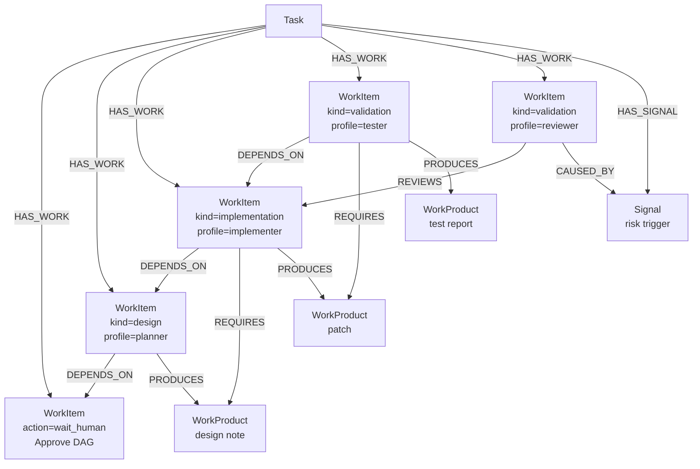

# Agent 协作图模型设计

日期：2026-05-06

本文记录 pilotfy 的 Agent WorkItem DAG / graph orchestration 设计。目标是把当前偏 provenance 的 graph projection 演进为面向 agent 自动执行的任务编排模型。

> 说明：当前 `task` / `planner` 系统仍是临时实现，主要服务 workspace routing 和早期 graph projection 验证；其 API、状态机、planner 事件、Task 与 WorkItem 的关系都尚未定型。本文描述的是目标方向，不应视为对当前 `task` / `planner` 代码结构的最终确认。

核心结论：

- **用户审阅的是同一张将被执行的 WorkItem DAG**，不拆 Plan DAG 和 Execution DAG。
- **WorkItem DAG 是计划结构，也是执行拓扑**；图中节点不是 superpowers 式的人类协作角色模拟。
- **WorkItem / DAG 关系长期适合放在 lbug**，因为它们天然是图结构。
- **WorkItemRun / 调度状态适合放在 SQLite**，因为它们是运行时事实和调度 projection。
- **原始事实应来自 append-only event store**；lbug 和 SQLite runtime projection 都由事件驱动，避免双重事实来源。
- **Planner 建初始 DAG，Scheduler 机械推进 DAG，RePlanner 受控生成 DAG Patch**；worker agent 和用户可以唤起 replanning，但不能直接改图。

## 背景

当前 `tasks` / `planner` 实现是阶段性方案：planner 主要负责 workspace resolution，并把 planner decision 投影成简化的 `Plan task` WorkItem provenance。它不是最终的 DAG orchestrator 设计，也不代表未来 Task / WorkItem / Planner 的稳定边界。

当前 WorkItem 图模型参考了 superpowers skills 的 planner / executor / reviewer 编排方式。但 superpowers 更偏向人类参与的软件工程流程，中间会保留大量人类交互、spec 审批、review loop 和手动确认。

pilotfy 的 DAG 编排目标不同：

1. 面向 agent 自动执行，而不是模拟人类团队协作。
2. 减少人类交互，只在计划审批、高风险变更、无法决策、最终发布等关键点打断用户。
3. 让用户审阅真实会被执行的 DAG，而不是审阅一份和执行图可能漂移的计划文档。
4. 限制 reviewer，避免过度 review 带来的延迟、token 成本和干扰。
5. 支持长期任务的计划演化、失败恢复、provenance、WorkProduct 追踪和影响分析。

因此，本设计把 `WorkItem` 定义为 **agent 可执行的计划节点**，而不是 `planner` / `executor` / `reviewer` 这类角色节点。

## 总体架构

长期理想架构分为三层：

```text
Event Store
  append-only facts，系统事实源，可重放

lbug Semantic Graph Store
  WorkItem、DAG 边、provenance、review/work-product/signal 关系

SQLite Operational Projection
  WorkItemRun、调度状态、lease、retry、turn/session 关联、idempotency
```

数据流：

```text
External API / Orchestrator
        |
        v
  append events
        |
        +--> project to lbug graph
        |
        +--> project to SQLite runtime/scheduler views
```

原则：

- Event Store 保存不可变事实。
- lbug 保存 DAG 和语义关系，用于用户审阅、可视化、provenance、影响分析。
- SQLite 保存调度器需要原子读写的运行时 projection。
- External API 可以聚合 lbug 和 SQLite projection，但不能让二者各自成为互相冲突的事实源。

## 数据归属

| 数据                                  | 长期归属                 | 说明                                        |
| ------------------------------------- | ------------------------ | ------------------------------------------- |
| Task 基本信息                         | SQLite / Event Store     | 顶层用户意图和状态聚合                      |
| Task 事件历史                         | Event Store              | append-only，可重放                         |
| WorkItem                              | lbug + Event Store       | DAG 节点定义，计划结构                      |
| WorkItem 依赖边                       | lbug + Event Store       | `DEPENDS_ON` / `REVIEWS` / `SUPERSEDES` 等  |
| WorkItemRun                           | SQLite + Event Store     | 某次具体执行尝试                            |
| WorkItem runtime projection           | SQLite                   | ready/running/failed/retry/lease 等调度快照 |
| Session / Turn / Runtime              | SQLite                   | 现有控制平面事实                            |
| Runtime Artifact metadata             | SQLite                   | session/turn 直接输出的文件元信息、大小、类型、引用 |
| WorkProduct / Signal / Review provenance | lbug                  | DAG 内逻辑工作产物的关系追踪和解释          |
| Human approval                        | Event Store + projection | 审批事实，投影到图和状态                    |
| DAG 可视化 / 影响分析                 | lbug                     | 图查询天然适合                              |

## 单一 WorkItem DAG

系统不维护独立的 Plan DAG 和 Execution DAG。

```text
Task -> WorkItem DAG
```

这张 DAG 同时承担：

1. 用户审阅对象：用户确认“系统准备做什么”。
2. 调度输入：orchestrator 根据依赖、策略、状态决定下一步。
3. 执行拓扑：WorkItem 之间的依赖、review、supersede、WorkProduct 流动。
4. provenance 骨架：Signal、WorkProduct、Agent、Review 关系挂接到 DAG 上。

DAG 可以演化，但演化必须通过事件记录，例如：

```text
dag.proposed
dag.approved
work_item.created
work_item.superseded
work_item.edge_added
work_item.review_required
human.approved
```

旧路径不删除，用 `SUPERSEDES` 和 obsolete/active 语义保留溯源。

## Planner / Scheduler / RePlanner

DAG 编排分为三个核心职责：

```text
Planner   = 初始建图
Scheduler = 机械推进
RePlanner = 受控改图
```

### Planner

Planner 负责根据用户任务、workspace context、可用 agent capability 和 policy defaults 生成初始 WorkItem DAG。

Planner 的输出是结构化 DAG，不直接执行任务。初始 DAG 应进入用户审阅或 policy approval 流程，审批后才由 Scheduler 推进。

### DAG Scheduler

DAG Scheduler 是 deterministic 程序逻辑，不是 LLM agent。

它负责：

- 找出 ready WorkItem；
- 检查依赖、review gate、human gate 和 policy budget；
- 创建或复用 Session；
- 为 WorkItem 创建 WorkItemRun；
- 向 Session 提交 Turn；
- 监听 Turn / adapter / work item 事件；
- 更新 SQLite runtime projection；
- 根据 retry / failure policy 机械地 retry、block、fail 或唤起 RePlanner；
- 应用已经通过校验和审批的 DAG Patch。

Scheduler 不自由发挥，不直接做智能规划，也不让 agent 自行修改 DAG。

### RePlanner

RePlanner 负责根据已有 DAG、运行状态、Signal / ReplanRequest 和 policy constraints 生成 DAG Patch。

RePlanner 可以由人类唤起，也可以由 worker agent 或系统事件间接唤起：

```text
Human requirement change -> Signal -> RePlanner
Worker finding           -> ReplanRequest -> RePlanner
System failure           -> Signal -> RePlanner
Reviewer feedback        -> ReplanRequest -> RePlanner
```

RePlanner 输出 patch，不输出整张新 DAG，也不直接写 lbug 或 SQLite。

DAG Patch 由 deterministic orchestrator 校验、由 policy 或 human 审批，再被应用。

### Worker Agent

Worker agent 只执行分配给它的 WorkItemRun。执行中如果发现计划缺陷、缺少前置工作、scope 变化或风险，应发出 `Signal` / `ReplanRequest`，而不是直接修改 DAG。

### Human

Human 负责审批初始 DAG、高风险 patch、scope/budget/release 行为变化，以及系统无法合理自动决策的问题。

## Planning / RePlanning Conversation

本设计不要求完全消除人类和 agent 的密集对话。相反，密集对话应被限制在少数高价值阶段：

```text
Initial DAG Planning
RePlanning / DAG Patch
```

普通 WorkItem 执行阶段应尽量低交互，由 Scheduler 机械推进；必要交互集中在规划和改图阶段。

### Initial DAG Planning Conversation

初始规划可以是多轮对话，用于澄清：

- 用户真实意图；
- scope 边界；
- workspace / repo context；
- risk areas；
- acceptance criteria；
- 可用 execution profiles；
- 是否需要 human gate / review gate。

规划对话可以复用现有 Session / Turn 模型，以 `planner` execution profile 运行。对话期间可以产生 draft DAG，但 draft 不直接改变可执行 DAG。

推荐状态流：

```text
task.created
  -> planning_session.created
  -> planning_in_progress
  -> dag.draft_proposed
  -> dag.awaiting_approval
  -> dag.approved
  -> scheduler starts
```

如果 planner 需要用户输入：

```text
planning_needs_input
  -> user message
  -> planning resumes
```

### RePlanning Conversation

RePlanning 可以由用户、worker agent、reviewer 或系统事件触发。它同样可以是多轮对话，用于理解变化、约束和影响范围。

触发示例：

```text
User changes requirement
Worker emits finding
Reviewer blocks downstream
System detects repeated failure
```

推荐状态流：

```text
signal.emitted / replan.requested
  -> replanning_session.created
  -> replanning_in_progress
  -> dag.patch_draft_proposed
  -> patch.awaiting_approval
  -> dag.patch_approved
  -> dag.patch_applied
```

### Conversation 与 DAG Mutation 的边界

对话可以密集，但不能直接修改 DAG。真正修改 DAG 必须经过：

```text
conversation turns
  -> draft DAG / draft DAGPatch
  -> schema validation
  -> policy validation
  -> human/policy approval
  -> dag.approved / dag.patch_applied events
```

原则：

- Planner/RePlanner 可以和用户、worker、reviewer 多轮讨论。
- 中间对话只产生 context、draft 或 Signal，不改变权威 DAG。
- 只有结构化 DAG / DAGPatch 通过校验和审批后，Scheduler 才能应用。
- Scheduler 不参与自由对话，只消费 approved DAG / applied patch。
- Worker agent 如果发现计划问题，应发出 `Signal` / `ReplanRequest`，而不是直接改 DAG。

## Execution Profile 集成

WorkItem 使用 `execution_profile_id` 引用外部注册的执行模板。Profile 用于告诉 Scheduler：这个 WorkItem 应该用什么 prompt、什么 session reuse policy、什么输出格式和什么行为边界执行。

调度流程：

```text
WorkItem ready
  -> read execution_profile_id/version
  -> resolve profile from registry
  -> find reusable Session matching workspace/task/profile
  -> if none, create Session from profile defaults
  -> render WorkItem turn prompt from profile + WorkItem fields
  -> create WorkItemRun with profile id/version/rendered prompt ref
  -> submit Turn
```

Session identity 模型继续适用，但它表示具体 runtime 身份：

```text
Session.handle      = 可寻址名称，例如 @rust-impl-1
Session.role        = 人类可读职责，例如 Rust backend implementer
Session.description = 该 session 的使命说明
Session.metadata.execution_profile_id = 实际 profile
```

`execution_profile_id` 不等于 `Session.role`：前者是可注册执行模板，后者是具体 session 的身份描述。

Profile 应版本化；WorkItemRun 必须记录实际使用的 `execution_profile_id`、`execution_profile_version` 和 `rendered_prompt_ref`，以便之后解释某次执行是在什么约束下完成的。

## DAG Patch Protocol

DAG 会随需求变化、agent 发现和系统失败而演化，但所有演化必须通过 patch protocol。

典型来源：

- 用户修改需求；
- worker agent 发现缺少前置任务；
- tester/reviewer 发现设计或实现缺口；
- 系统检测到测试失败、runtime crash、WorkProduct 或 runtime artifact missing、timeout；
- policy 判断需要插入 review / debugger / human gate。

Patch 结构：

```text
DAGPatch {
  patch_id
  task_id
  caused_by_signal_id
  summary
  risk_level
  requires_human_approval
  operations
}
```

Patch operation 示例：

```text
add_work_item
supersede_work_item
add_edge
remove_edge
update_policy
update_acceptance_criteria
mark_optional
insert_review
insert_human_gate
```

Orchestrator 校验内容：

- patch schema 合法；
- 引用的 WorkItem / edge 存在；
- 不产生依赖环；
- 不删除已完成事实；
- 不绕过 required human gate；
- 不静默改变 running WorkItem；
- 不超出 budget / retry / review policy；
- 根据 risk/scope 判断是否需要 human approval。

应用原则：

- 优先 append / supersede，避免 destructive update；
- 只暂停 affected subgraph，不默认暂停整个 DAG；
- running WorkItem 默认允许完成，除非 patch policy 要求 interrupt/cancel；
- scope、risk、budget 或 release 行为变化需要 human approval；
- 自动应用的 patch 仍必须记录事件并可追溯。

推荐流程：

```text
User submits Task
   |
Planner generates initial WorkItem DAG
   |
Human/policy approves DAG
   |
Scheduler starts mechanical execution
   |
Worker executes WorkItemRun
   |
Worker/System/Human emits Signal or ReplanRequest
   |
Scheduler pauses affected subgraph if needed
   |
RePlanner generates DAGPatch
   |
Orchestrator validates patch
   |
Policy/Human approves patch
   |
Scheduler applies patch and recomputes ready set
```

## WorkItem

本文中 `WorkItem` 指 DAG 节点定义；具体执行尝试称为 `WorkItemRun`。

`WorkItem` 是 DAG 节点本体，回答：

> 这个节点要做什么？如何执行？依赖什么？如何验收？什么情况下 review 或升级？

它适合放在 lbug 中，并由 event store 记录其创建和变更事实。

建议字段：

```text
WorkItem {
  work_item_id
  task_id

  title
  description

  kind
  action
  execution_profile_id
  execution_profile_version

  inputs
  expected_outputs
  acceptance_criteria

  review_policy
  execution_policy
  escalation_policy

  priority
  optional
  parallelizable

  created_by
  created_at
  updated_at

  metadata
}
```

### kind

表示工作性质，不表示 agent 角色：

```text
investigation
design
implementation
validation
integration
documentation
release
cleanup
```

### action

表示 orchestrator 如何执行：

```text
agent_turn
run_command
inspect_work_product
wait_human
aggregate_results
```

### execution_profile_id

表示执行时使用的外部可注册执行模板。Profile 不代表 agent 实例或 session 身份，而是把 WorkItem 映射到具体 prompt、session reuse policy、输出格式和行为约束。

示例：

```text
default
planner
replanner
implementer
reviewer
tester
debugger
documenter
rust-implementer
api-reviewer
```

`reviewer` 是 execution profile，不是默认 DAG 类型。WorkItem 可以不指定 profile；未指定时使用 `default`。如果指定的 profile 不存在，DAG approval 或 scheduler 应将该 WorkItem 标记为 blocked。

Profile 系统应独立实现为可外部注册的 registry，详见 `specs/2026-05-11-agent-profile-design.md`。

## WorkItemRun

`WorkItemRun` 表示某个 WorkItem 的一次具体执行尝试，适合放在 SQLite，因为它是运行时事实和调度数据。

```text
WorkItemRun {
  run_id
  work_item_id
  task_id

  attempt
  state

  session_id
  turn_id
  client_type

  execution_profile_id
  execution_profile_version
  rendered_prompt_ref

  started_at
  completed_at

  failure
  output_summary

  consumed_artifact_ids
  produced_artifact_ids

  created_at
  updated_at
}
```

建议状态：

```text
queued
ready
running
completed
failed
cancelled
skipped
needs_input
```

一个 WorkItem 可以有多次 Run：

```text
wi_1 attempt 1 failed
wi_1 attempt 2 completed
```

lbug 可以投影 `(:WorkItem)-[:HAS_RUN]->(:WorkItemRun)` 之类的关系用于 provenance 展示，但 run state 的权威仍应来自 SQLite runtime projection / event store。

## SQLite 调度 Projection

调度器需要快速、原子地回答：

- 哪些 WorkItem ready？
- 哪个节点可以被 claim？
- 当前 retry 次数是多少？
- 这个节点是否已有 running turn？
- lease 是否过期？

因此建议维护 SQL projection，例如：

```text
WorkItemRuntimeProjection {
  work_item_id
  task_id

  current_run_id
  current_state
  current_attempt

  ready_at
  blocked_reason

  retry_count
  max_retries

  priority
  optional
  parallelizable

  session_id
  turn_id

  lease_owner
  lease_expires_at

  updated_at
}
```

调度器主要读写这个 projection，而不是直接把 lbug 当 ready queue。

## Review 设计

Reviewer 不应默认成为每个节点之后的固定节点。

Review 首先是 WorkItem 的策略：

```text
ReviewPolicy {
  mode: none | lightweight | risk_based | required
  triggers
  required_reviewers
  blocks_downstream
}
```

模式：

- `none`：不审查，适合低风险节点。
- `lightweight`：执行 agent 自检或快速验证。
- `risk_based`：满足触发条件时才 materialize review WorkItem。
- `required`：必须创建并通过 review WorkItem。

触发条件示例：

```text
touches_critical_files
changes_more_than_n_files
test_failed_then_fixed
low_confidence
public_api_change
migration_change
security_sensitive
```

当触发 review 时，orchestrator 可以在同一张 DAG 中插入 review 节点：

```text
Implementation WorkItem -> Review WorkItem -> Integration WorkItem
```

这仍然是同一张 WorkItem DAG 的演化，不产生第二张图。

## Human Gate 设计

Human gate 也可以是 WorkItem，但应该稀疏出现。

默认只在以下场景需要人类交互：

1. 初始 DAG 审批。
2. DAG 发生重大结构变化。
3. 高风险节点需要人工确认。
4. agent 无法合理决策，需要输入。
5. 最终 merge / release 前审批。

示例：

```text
WorkItem {
  kind: validation
  action: wait_human
  title: "Approve execution DAG"
}
```

用户审阅的是将被执行的 WorkItem DAG，而不是独立 spec 文档。

## 策略字段

### ExecutionPolicy

```text
ExecutionPolicy {
  max_turns
  max_retries
  timeout_ms
  failure_strategy
  allow_parallel
}
```

`failure_strategy` 建议值：

```text
fail_task
retry
ask_human
skip_if_optional
spawn_debugger
```

### EscalationPolicy

```text
EscalationPolicy {
  on_ambiguity: ask_human | make_reasonable_assumption | fail
  on_repeated_failure: ask_human | spawn_debugger | fail_task
  on_scope_change: ask_human | revise_dag
}
```

这些 policy 用来限制无限 planning、无限 review、无限 retry，避免 agent 编排变成高成本官僚流程。

## 核心图节点

最小核心节点：

```text
Task
WorkItem
Agent
WorkProduct
Signal
```

可选投影节点：

```text
WorkItemRun
HumanApproval
ReviewResult
```

### Task

顶层用户意图。

```cypher
Task(
  task_id STRING PRIMARY KEY,
  title STRING,
  description STRING,
  ref STRING,
  created_at STRING,
  updated_at STRING
)
```

### WorkItem

DAG 中的计划/执行节点定义。

```cypher
WorkItem(
  work_item_id STRING PRIMARY KEY,
  task_id STRING,
  title STRING,
  description STRING,
  kind STRING,
  action STRING,
  execution_profile_id STRING,
  execution_profile_version STRING,
  review_policy STRING,
  execution_policy STRING,
  escalation_policy STRING,
  priority INT64,
  optional BOOL,
  parallelizable BOOL,
  active BOOL,
  ref STRING,
  created_at STRING,
  updated_at STRING
)
```

说明：

- `kind`：工作性质，例如 `implementation`、`validation`。
- `action`：调度动作，例如 `agent_turn`、`wait_human`。
- `execution_profile_id`：执行模板引用，例如 `implementer`、`reviewer`、`rust-implementer`。
- `review_policy` / `execution_policy` / `escalation_policy`：JSON string。
- `active`：当前 DAG 有效性。被 supersede 的节点保留但 `active=false`。
- `ref`：事件或外部数据引用，例如 `event:work_item.created:<event_id>`。

WorkItem 不直接保存高频运行状态；运行状态在 SQLite projection。

### Agent

抽象 Agent。角色是属性，不是 label。

```cypher
Agent(
  agent_id STRING PRIMARY KEY,
  name STRING,
  role STRING,
  capabilities STRING,
  availability STRING,
  ref STRING,
  created_at STRING,
  updated_at STRING
)
```

### WorkProduct

WorkItem 之间传递的逻辑工作产物、文档契约或证据。真实内容不放图里。

注意：`WorkProduct` 不等于当前 SQLite `artifacts` 表中的 runtime artifact。当前 artifact 系统继续表示 session / turn 直接输出或 workspace discovery 得到的实际文件索引。`WorkProduct` 是 DAG 内部的逻辑产物，可以通过 `ref` 指向一个 runtime artifact，例如 `sqlite:artifact:<artifact_id>`。

```cypher
WorkProduct(
  work_product_id STRING PRIMARY KEY,
  task_id STRING,
  kind STRING,
  name STRING,
  summary STRING,
  availability STRING,
  ref STRING,
  metadata STRING,
  created_at STRING,
  updated_at STRING
)
```

### Signal

触发规划变化的信息。Signal 可以来自用户、Agent 或系统。

```cypher
Signal(
  signal_id STRING PRIMARY KEY,
  source_type STRING,
  kind STRING,
  summary STRING,
  detail STRING,
  origin_ref STRING,
  created_at STRING
)
```

Signal 不承载大量上下文。上下文、证据、文件、对话片段通过 `SUPPORTED_BY` 关联到 WorkProduct，或通过 `origin_ref` 定位外部数据。

## 核心关系

### Task 关系

```cypher
HAS_WORK(FROM Task TO WorkItem)
HAS_SIGNAL(FROM Task TO Signal)
```

### WorkItem 拓扑关系

```cypher
DEPENDS_ON(FROM WorkItem TO WorkItem)
REVIEWS(FROM WorkItem TO WorkItem)
SUPERSEDES(FROM WorkItem TO WorkItem)
CAUSED_BY(FROM WorkItem TO Signal)
```

语义：

- `DEPENDS_ON`：执行拓扑依赖。
- `REVIEWS`：review WorkItem 审查另一个 WorkItem。
- `SUPERSEDES`：新 WorkItem 替代旧 WorkItem。
- `CAUSED_BY`：WorkItem 或计划变化由某个 Signal 导致。

### 派发与 WorkProduct 关系

```cypher
ASSIGNED_TO(FROM WorkItem TO Agent)
REQUIRES(FROM WorkItem TO WorkProduct)
PRODUCES(FROM WorkItem TO WorkProduct)
```

### Signal 与证据关系

```cypher
EMITS(FROM Agent TO Signal)
SUPPORTED_BY(FROM Signal TO WorkProduct)
```

### WorkProduct 派生关系

```cypher
DERIVED_FROM(FROM WorkProduct TO WorkProduct)
```

### WorkProduct 最小语义

第一版不把 WorkProduct 设计过重。它只是 DAG 内的逻辑产物占位符，可被 WorkItem require/produce，并可选地指向真实 runtime artifact。

`availability` 第一版只支持：

```text
expected
available
missing
obsolete
```

`ref` 是可选外部引用。如果 WorkProduct 已对应当前 SQLite `artifacts` 表中的 runtime artifact，使用：

```text
sqlite:artifact:<artifact_id>
```

如果还没有真实产物：

```text
availability = expected
ref = ""
```

`metadata` 用于暂存尚未定型的扩展字段，例如：

```json
{
  "schema_ref": "...",
  "media_type": "...",
  "runtime_artifact_id": "...",
  "notes": "..."
}
```

第一版不新增 `MATERIALIZED_BY` 关系；materialization 通过 `WorkProduct.ref` 指向 runtime artifact 表达。

## 状态设计

WorkItem 不维护高频执行状态。状态分层如下：

```text
DAG validity:
  active / superseded
  存在于 lbug WorkItem.active 和 SUPERSEDES 边

Run state:
  queued / ready / running / completed / failed / cancelled / skipped / needs_input
  存在于 SQLite WorkItemRun / runtime projection

Task state:
  awaiting_approval / running / blocked / completed / failed / cancelled
  由 WorkItemRun 和 DAG 拓扑聚合
```

`ready` 不作为 lbug 中 WorkItem 的主字段保存，而由调度 projection 计算和维护：

```text
ready =
  WorkItem.active = true
  AND latest runtime state is queued/pending
  AND all required DEPENDS_ON work items completed
  AND required WorkProducts available
  AND no blocking review/human gate is pending
  AND policy budgets allow execution
```

## 事件模型草案

关键事件示例：

```text
task.created
dag.proposed
dag.approved
dag.revised
work_item.created
work_item.edge_added
work_item.edge_removed
work_item.superseded
work_item.run_created
work_item.started
work_item.completed
work_item.failed
work_item.needs_input
work_item.review_required
work_item.review_passed
work_item.review_failed
work_product.expected
work_product.materialized
work_product.obsoleted
runtime_artifact.produced
signal.emitted
human.approved
human.rejected
```

这些事件是重建 lbug graph 和 SQLite runtime projection 的基础。

## Mermaid 示例



## Ladybug 初始化 Schema 草案

```cypher
CREATE NODE TABLE IF NOT EXISTS Task(
  task_id STRING,
  title STRING,
  description STRING,
  ref STRING,
  created_at STRING,
  updated_at STRING,
  PRIMARY KEY(task_id)
);

CREATE NODE TABLE IF NOT EXISTS WorkItem(
  work_item_id STRING,
  task_id STRING,
  title STRING,
  description STRING,
  kind STRING,
  action STRING,
  execution_profile_id STRING,
  execution_profile_version STRING,
  review_policy STRING,
  execution_policy STRING,
  escalation_policy STRING,
  priority INT64,
  optional BOOL,
  parallelizable BOOL,
  active BOOL,
  ref STRING,
  created_at STRING,
  updated_at STRING,
  PRIMARY KEY(work_item_id)
);

CREATE NODE TABLE IF NOT EXISTS Agent(
  agent_id STRING,
  name STRING,
  role STRING,
  capabilities STRING,
  availability STRING,
  ref STRING,
  created_at STRING,
  updated_at STRING,
  PRIMARY KEY(agent_id)
);

CREATE NODE TABLE IF NOT EXISTS WorkProduct(
  work_product_id STRING,
  task_id STRING,
  kind STRING,
  name STRING,
  summary STRING,
  availability STRING,
  ref STRING,
  metadata STRING,
  created_at STRING,
  updated_at STRING,
  PRIMARY KEY(work_product_id)
);

CREATE NODE TABLE IF NOT EXISTS Signal(
  signal_id STRING,
  source_type STRING,
  kind STRING,
  summary STRING,
  detail STRING,
  origin_ref STRING,
  created_at STRING,
  PRIMARY KEY(signal_id)
);

CREATE REL TABLE IF NOT EXISTS HAS_WORK(FROM Task TO WorkItem);
CREATE REL TABLE IF NOT EXISTS HAS_SIGNAL(FROM Task TO Signal);
CREATE REL TABLE IF NOT EXISTS DEPENDS_ON(FROM WorkItem TO WorkItem);
CREATE REL TABLE IF NOT EXISTS REVIEWS(FROM WorkItem TO WorkItem);
CREATE REL TABLE IF NOT EXISTS SUPERSEDES(FROM WorkItem TO WorkItem);
CREATE REL TABLE IF NOT EXISTS CAUSED_BY(FROM WorkItem TO Signal);
CREATE REL TABLE IF NOT EXISTS ASSIGNED_TO(FROM WorkItem TO Agent);
CREATE REL TABLE IF NOT EXISTS REQUIRES(FROM WorkItem TO WorkProduct);
CREATE REL TABLE IF NOT EXISTS PRODUCES(FROM WorkItem TO WorkProduct);
CREATE REL TABLE IF NOT EXISTS EMITS(FROM Agent TO Signal);
CREATE REL TABLE IF NOT EXISTS SUPPORTED_BY(FROM Signal TO WorkProduct);
CREATE REL TABLE IF NOT EXISTS DERIVED_FROM(FROM WorkProduct TO WorkProduct);
```

## SQLite Runtime Schema 草案

```sql
CREATE TABLE work_item_runs (
    run_id TEXT PRIMARY KEY NOT NULL,
    work_item_id TEXT NOT NULL,
    task_id TEXT NOT NULL,
    attempt INTEGER NOT NULL,
    state TEXT NOT NULL,
    session_id TEXT,
    turn_id TEXT,
    client_type TEXT,
    execution_profile_id TEXT,
    execution_profile_version TEXT,
    rendered_prompt_ref TEXT,
    started_at TEXT,
    completed_at TEXT,
    failure TEXT,
    output_summary TEXT,
    created_at TEXT NOT NULL DEFAULT (strftime('%Y-%m-%dT%H:%M:%fZ', 'now')),
    updated_at TEXT NOT NULL DEFAULT (strftime('%Y-%m-%dT%H:%M:%fZ', 'now')),
    FOREIGN KEY(task_id) REFERENCES tasks(task_id),
    FOREIGN KEY(session_id) REFERENCES sessions(session_id),
    FOREIGN KEY(turn_id) REFERENCES turns(turn_id)
);

CREATE TABLE work_item_runtime_projection (
    work_item_id TEXT PRIMARY KEY NOT NULL,
    task_id TEXT NOT NULL,
    current_run_id TEXT,
    current_state TEXT NOT NULL,
    current_attempt INTEGER NOT NULL DEFAULT 0,
    ready_at TEXT,
    blocked_reason TEXT,
    retry_count INTEGER NOT NULL DEFAULT 0,
    max_retries INTEGER,
    priority INTEGER NOT NULL DEFAULT 0,
    optional INTEGER NOT NULL DEFAULT 0,
    parallelizable INTEGER NOT NULL DEFAULT 0,
    session_id TEXT,
    turn_id TEXT,
    lease_owner TEXT,
    lease_expires_at TEXT,
    updated_at TEXT NOT NULL DEFAULT (strftime('%Y-%m-%dT%H:%M:%fZ', 'now')),
    FOREIGN KEY(task_id) REFERENCES tasks(task_id),
    FOREIGN KEY(current_run_id) REFERENCES work_item_runs(run_id)
);

CREATE INDEX idx_work_item_runs_work_item ON work_item_runs(work_item_id, attempt);
CREATE INDEX idx_work_item_runs_turn ON work_item_runs(turn_id);
CREATE INDEX idx_work_item_runtime_ready ON work_item_runtime_projection(current_state, priority, ready_at);
```

## 当前实现状态

当前项目已经实现了 WorkItem DAG 编排的一版可运行骨架，不再只是早期 task/planner scaffolding。整体状态是：**核心执行链路基本符合本文目标模型，语义图、审批、策略和治理能力仍未完整落地**。

已实现或基本实现：

- `Task` 仍承载顶层用户意图、workspace/session/turn 路由和聚合状态，但 DAG task 已通过 `metadata.mode = "dag"` 与普通任务区分。
- `Planner` / `RePlanner` 已能通过 DAG-managed planning turn 产出结构化初始 DAG 或 DAG Patch，并通过 `submitPlan` 进入系统。
- 系统当前维护的是同一张 WorkItem DAG：planner 产出的 DAG 被投影到 graph store，并作为 scheduler 的执行拓扑；没有独立的 Plan DAG / Execution DAG。
- `WorkItem` 与 DAG 边已经从 SQLite graph tables 迁移到 lbug graph store；历史 SQLite graph store 已被移除。
- `GraphProjectionService` 现在从 `task_events` 重放并投影 `Task`、`WorkItem`、`Signal` 和 WorkItem 边到 lbug，而不只是生成简化 provenance。
- `WorkItemRun` 和 `work_item_runtime_projection` 保存在 SQLite，用于运行状态、ready/blocked/running/completed、attempt、session/turn 关联等调度视图。
- `DagSchedulerService` 已实现 deterministic 调度：读取 lbug DAG + SQLite runtime projection，计算 ready WorkItem，创建 WorkItemRun，创建/复用执行 profile 对应的 Session，并 dispatch Turn。
- Worker agent 可通过 `submitResult` 完成当前 WorkItemRun，也可通过 `raiseSignal` 发出 `needs_input`、`replan_requested`、`missing_dependency`、`scope_change` 等信号；`replan_requested` 可触发 RePlanner。
- DAG Patch 已支持新增 WorkItem、增删边、替换边、supersede/reactivate、设置 WorkItem outcome、插入中间 WorkItem、替换下游路径，以及 `supersede_policy` 控制的自动 supersede。
- `execution_profile_id` / `execution_profile_version` 已接入 WorkItem、WorkItemRun、Session 和 prompt rendering；profile registry 已支持版本和归档。

仍未完整符合本文目标模型：

- 初始 DAG 和 DAG Patch 目前主要是提交后校验并立即 apply/schedule；尚未实现稳定的 `dag.proposed -> awaiting_approval -> approved -> applied` 人类/策略审批流。
- Human gate 还不是完整的 WorkItem action 语义。当前 validator 支持 `agent_turn`、`human_input`、`noop`，但没有实现本文建议的 `wait_human` 调度行为。
- WorkProduct 语义节点与 `REQUIRES`、`PRODUCES`、`SUPPORTED_BY`、`DERIVED_FROM` 等关系尚未实现；`submitResult.outputs` 目前主要作为 run 输出摘要/事件 payload，而不是 graph 中的 WorkProduct。
- Agent 语义节点与 `ASSIGNED_TO`、`EMITS` 等关系尚未实现；当前 agent/runtime 身份主要体现在 Session、profile 和 turn metadata 中。
- Review 仍主要体现为 execution profile 或普通 WorkItem；尚未实现 `ReviewPolicy` 的 risk trigger 评估和自动 materialize review WorkItem。
- `review_policy`、`execution_policy`、`escalation_policy` 字段已出现在 graph schema 中，但 WorkItemDraft/API 和 scheduler 对这些 policy 的执行还不完整。
- Scheduler 目前没有完整实现 lease、timeout、max retry/failure strategy、budget、review gate、WorkProduct availability 等机制。
- lbug schema 与本文草案仍有少量差异，例如 `CAUSED_BY` 当前建模为 WorkItem 到 WorkItem 的边，而本文目标是 WorkItem 到 Signal。
- kind/action 枚举仍偏当前实现：`design`、`implementation`、`review`、`test`、`debug`、`documentation`、`planning`、`other` 和 `agent_turn`、`human_input`、`noop`；尚未完全采用本文建议的 `investigation`、`validation`、`run_command`、`wait_human` 等命名。

因此，后续实现 DAG orchestrator 时不再需要从零重写 task/planner 边界；更合理的方向是在现有 DAG-managed task、lbug projection、SQLite runtime projection、Scheduler、RePlanner Patch Protocol 之上补齐审批流、WorkProduct/Agent 语义图、policy enforcement、retry/lease 和 human/review gate。

## 设计原则

1. 用户审阅的是唯一的 WorkItem DAG，DAG 同时是计划和执行拓扑。
2. `WorkItem` 是 agent 可执行节点，不是 planner/executor/reviewer 角色模拟。
3. `kind` 表达工作性质，`action` 表达调度动作，`execution_profile_id` 引用外部可注册执行模板。
4. reviewer 默认是 policy；只有显式 required 或 risk trigger 命中时才 materialize 为 WorkItem。
5. 人类交互应稀疏，只用于审批、重大变化、高风险和无法自动决策。
6. WorkItem / DAG 关系长期适合 lbug；WorkItemRun / 调度状态适合 SQLite。
7. Event Store 是原始事实来源；lbug 和 SQLite projection 都应可由事件重建。
8. lbug 不是普通缓存，而是语义图索引和 DAG/provenance 查询模型。
9. 调度器不直接依赖 lbug 作为 ready queue；调度 claim、retry、lease 走 SQLite runtime projection。
10. 旧计划路径保留，用 `SUPERSEDES` / `active=false` 表达计划演化，不直接删除历史节点。
