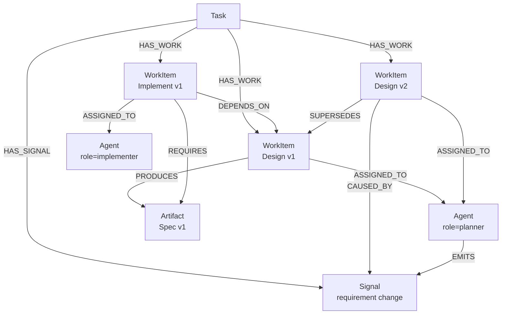

# Agent 协作图模型设计

日期：2026-05-06

本文描述当前可选 graph projection 的模型边界和未来设计方向。Graph 是 feature-gated 能力；SQLite / event store 仍是执行事实的权威来源。

## 背景

图数据库用于表达多 agent 协作、任务拆解、计划演化和 provenance 关系。它不承担 SQLite 业务表镜像职责，也不作为 session、turn、event、runtime 状态的权威来源。

图模型目标是：

1. 表达一个顶层任务如何被拆解成一组可执行的规划节点。
2. 表达 WorkItem 之间的串行、并行和计划演化关系。
3. 表达哪些 Agent 被派发去执行哪些 WorkItem。
4. 表达 WorkItem 之间通过 Artifact 形成输入/输出依赖。
5. 表达用户、Agent 或系统产生的 Signal 如何改变规划。
6. 保留被 supersede 的计划路径用于溯源，不删除已存在的计划节点。

## 边界

图数据库不作为 SQLite 的完整镜像。

职责划分：

```text
SQLite:
  session、turn、event、runtime 状态、artifact metadata、执行事实

文件系统:
  artifact 内容、日志、spec、patch、报告等大文本或文件

图数据库:
  任务拆解、agent 派发、artifact 依赖、计划演化、变化原因
```

图中的节点可以通过 `ref` 指向 SQLite 或文件系统中的真实数据。

示例：

```text
sqlite:task:task_123
sqlite:artifact:art_456
sqlite:turn:turn_789
fs:/home/cheny/projects/llmparty/spec/design.md
git:<repo>:<commit>:<path>
```

## 核心模型

Task 触发一张可演化的 WorkItem 计划图；Agent 执行 WorkItem；Artifact 作为输入/输出在 WorkItem 之间流动；Signal 解释为什么计划发生变化；旧路径保留用于溯源。

最小核心节点：

```text
Task
WorkItem
Agent
Artifact
Signal
```

## Mermaid 示例

下面是一个最小实例图，展示一次计划变化：



## 节点 Schema

### Task

顶层用户需求。

```cypher
Task(
  task_id STRING PRIMARY KEY,
  title STRING,
  description STRING,
  ref STRING,
  created_at STRING,
  updated_at STRING
)
```

字段说明：

- `task_id`：图内任务 ID。
- `title`：短标题。
- `description`：用户需求描述。
- `ref`：外部引用，例如 `sqlite:task:<task_id>`。

### WorkItem

具体规划节点。WorkItem 是计划图中的一等对象，串行、并行、计划变化都围绕它表达。

```cypher
WorkItem(
  work_item_id STRING PRIMARY KEY,
  title STRING,
  description STRING,
  kind STRING,
  planning_state STRING,
  execution_state STRING,
  execution_ref STRING,
  created_at STRING,
  updated_at STRING
)
```

字段说明：

- `kind`：工作类型，例如 `planning`、`research`、`design`、`implementation`、`review`、`verification`、`fix`。
- `planning_state`：规划有效性，建议值：`active`、`obsolete`。
- `execution_state`：执行事实，建议值：`pending`、`running`、`completed`、`failed`。
- `execution_ref`：执行事实引用，例如 `sqlite:turn:<turn_id>`。

注意：

- `WorkItem` 本身就是 plan node，所以不需要 `planned` 状态。
- `readiness` 不建议作为主字段保存，应由图关系和状态推导。

### Agent

抽象 Agent。角色是属性，不是 label。

```cypher
Agent(
  agent_id STRING PRIMARY KEY,
  name STRING,
  role STRING,
  capabilities STRING,
  availability STRING,
  ref STRING,
  created_at STRING,
  updated_at STRING
)
```

字段说明：

- `role`：例如 `graph_manager`、`planner`、`implementer`、`reviewer`。
- `capabilities`：JSON string，表示能力集合。
- `availability`：例如 `available`、`busy`、`unavailable`。
- `ref`：可选外部引用，例如 runtime、session 或用户身份。

### Artifact

WorkItem 之间传递的输入/输出边界。真实内容不放图里。

```cypher
Artifact(
  artifact_id STRING PRIMARY KEY,
  kind STRING,
  name STRING,
  summary STRING,
  availability STRING,
  ref STRING,
  created_at STRING,
  updated_at STRING
)
```

字段说明：

- `kind`：例如 `spec`、`patch`、`review`、`file`、`conversation_excerpt`、`test_report`。
- `summary`：摘要。
- `availability`：建议值：`expected`、`available`、`missing`、`obsolete`。
- `ref`：真实内容位置，例如 SQLite artifact、文件路径或 Git 引用。

### Signal

触发规划变化的信息。Signal 可以来自用户、Agent 或系统。

```cypher
Signal(
  signal_id STRING PRIMARY KEY,
  source_type STRING,
  kind STRING,
  summary STRING,
  detail STRING,
  origin_ref STRING,
  created_at STRING
)
```

字段说明：

- `source_type`：`user`、`agent`、`system`。
- `kind`：例如 `requirement_change`、`finding`、`feedback`、`failure`、`constraint`。
- `origin_ref`：Signal 来源引用，例如 conversation、event、turn、file。

Signal 不承载大量上下文。上下文、证据、文件、对话片段通过 `SUPPORTED_BY` 关联到 Artifact，或通过 `origin_ref` 定位外部数据。

## 关系 Schema

### Task 关系

```cypher
HAS_WORK(FROM Task TO WorkItem)
HAS_SIGNAL(FROM Task TO Signal)
```

语义：

- `HAS_WORK`：Task 拆解出的 WorkItem。
- `HAS_SIGNAL`：与 Task 相关的用户输入、Agent 发现或系统信号。

### WorkItem 关系

```cypher
DEPENDS_ON(FROM WorkItem TO WorkItem)
SUPERSEDES(FROM WorkItem TO WorkItem)
CAUSED_BY(FROM WorkItem TO Signal)
```

语义：

- `DEPENDS_ON`：执行依赖，用于表达串行和并行拓扑。
- `SUPERSEDES`：计划演化，新 WorkItem 替代旧 WorkItem。
- `CAUSED_BY`：新 WorkItem 或计划变化由某个 Signal 导致。

`DEPENDS_ON` 和 `SUPERSEDES` 都是 `WorkItem -> WorkItem`，但语义不同：

```text
DEPENDS_ON  = 执行拓扑，决定调度顺序
SUPERSEDES  = 计划演化，决定当前有效路径和溯源
```

### 派发与 Artifact 关系

```cypher
ASSIGNED_TO(FROM WorkItem TO Agent)
REQUIRES(FROM WorkItem TO Artifact)
PRODUCES(FROM WorkItem TO Artifact)
```

语义：

- `ASSIGNED_TO`：WorkItem 被派发给哪个 Agent。
- `REQUIRES`：WorkItem 需要哪些 Artifact 才能执行。
- `PRODUCES`：WorkItem 产出哪些 Artifact。

### Signal 与证据关系

```cypher
EMITS(FROM Agent TO Signal)
SUPPORTED_BY(FROM Signal TO Artifact)
```

语义：

- `EMITS`：Agent 发出 Signal。
- `SUPPORTED_BY`：Signal 的证据材料，例如 review report、conversation excerpt、file。

用户或系统产生的 Signal 可以只使用 `Signal.source_type` 和 `Signal.origin_ref` 表达来源；第一版不必为 User/System 单独建节点。

### Artifact 派生关系

```cypher
DERIVED_FROM(FROM Artifact TO Artifact)
```

语义：

- 新 Artifact 派生自旧 Artifact，例如 `spec v2 DERIVED_FROM spec v1`。

## 状态设计

### WorkItem 状态

WorkItem 保留两个状态维度：

```text
planning_state:
  active
  obsolete

execution_state:
  pending
  running
  completed
  failed
```

原因：

- `execution_state` 来自 SQLite / runtime / 外部执行事实，不能仅从图结构推导。
- `planning_state` 来自 graph manager 的规划决策，表示节点是否仍在当前有效计划中。
- `readiness` 不作为主字段保存，而由图关系和状态推导。

示例推导：

```text
ready =
  WorkItem.planning_state = active
  AND WorkItem.execution_state = pending
  AND all DEPENDS_ON WorkItem have execution_state = completed
  AND all REQUIRES Artifact have availability = available
  AND assigned Agent is available
```

### Artifact 状态

```text
availability:
  expected
  available
  missing
  obsolete
```

Artifact 的可用性通常来自 SQLite、文件系统或 Git 检查结果。

## 设计原则

1. 图数据库不是 SQLite 的重复投影。
2. `WorkItem` 是计划节点，plan 本身由 WorkItem DAG 表示。
3. 旧路径必须保留，不删除，用 `SUPERSEDES` 和 `planning_state=obsolete` 表达计划演化。
4. `Signal` 只解释为什么变化，不承载大量原始上下文。
5. `Artifact` 是 Agent 协作边界，真实内容通过 `ref` 外链。
6. 角色是 `Agent.role` 属性，不是节点 label。
7. 可调度性优先通过图关系和关键状态推导，不维护独立 `readiness` 真相源。

## Ladybug 初始化 Schema 草案

```cypher
CREATE NODE TABLE IF NOT EXISTS Task(
  task_id STRING,
  title STRING,
  description STRING,
  ref STRING,
  created_at STRING,
  updated_at STRING,
  PRIMARY KEY(task_id)
);

CREATE NODE TABLE IF NOT EXISTS WorkItem(
  work_item_id STRING,
  title STRING,
  description STRING,
  kind STRING,
  planning_state STRING,
  execution_state STRING,
  execution_ref STRING,
  created_at STRING,
  updated_at STRING,
  PRIMARY KEY(work_item_id)
);

CREATE NODE TABLE IF NOT EXISTS Agent(
  agent_id STRING,
  name STRING,
  role STRING,
  capabilities STRING,
  availability STRING,
  ref STRING,
  created_at STRING,
  updated_at STRING,
  PRIMARY KEY(agent_id)
);

CREATE NODE TABLE IF NOT EXISTS Artifact(
  artifact_id STRING,
  kind STRING,
  name STRING,
  summary STRING,
  availability STRING,
  ref STRING,
  created_at STRING,
  updated_at STRING,
  PRIMARY KEY(artifact_id)
);

CREATE NODE TABLE IF NOT EXISTS Signal(
  signal_id STRING,
  source_type STRING,
  kind STRING,
  summary STRING,
  detail STRING,
  origin_ref STRING,
  created_at STRING,
  PRIMARY KEY(signal_id)
);

CREATE REL TABLE IF NOT EXISTS HAS_WORK(FROM Task TO WorkItem);
CREATE REL TABLE IF NOT EXISTS HAS_SIGNAL(FROM Task TO Signal);
CREATE REL TABLE IF NOT EXISTS DEPENDS_ON(FROM WorkItem TO WorkItem);
CREATE REL TABLE IF NOT EXISTS SUPERSEDES(FROM WorkItem TO WorkItem);
CREATE REL TABLE IF NOT EXISTS CAUSED_BY(FROM WorkItem TO Signal);
CREATE REL TABLE IF NOT EXISTS ASSIGNED_TO(FROM WorkItem TO Agent);
CREATE REL TABLE IF NOT EXISTS REQUIRES(FROM WorkItem TO Artifact);
CREATE REL TABLE IF NOT EXISTS PRODUCES(FROM WorkItem TO Artifact);
CREATE REL TABLE IF NOT EXISTS EMITS(FROM Agent TO Signal);
CREATE REL TABLE IF NOT EXISTS SUPPORTED_BY(FROM Signal TO Artifact);
CREATE REL TABLE IF NOT EXISTS DERIVED_FROM(FROM Artifact TO Artifact);
```
